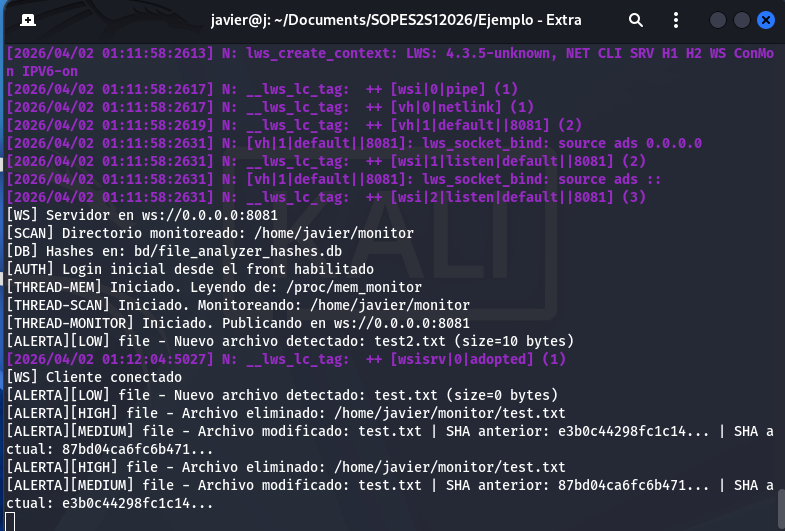
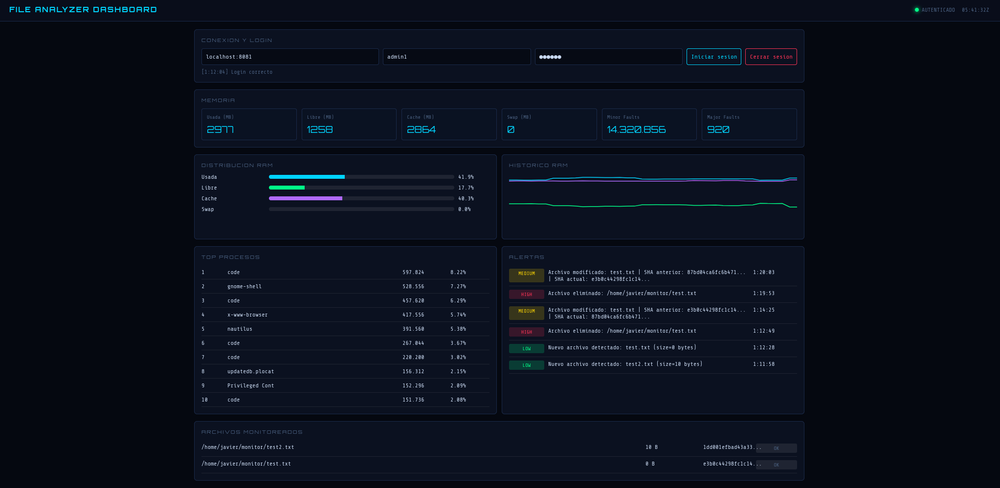

# File Analyzer + Monitor de Memoria + PAM (SO2)

## Indice
1. Descripcion general
2. Objetivo academico
3. Arquitectura del proyecto
4. Descripcion de archivos y carpetas
5. Dependencias
6. Guia para levantar el proyecto
7. Flujo de uso esperado
8. Que es PAM y como se usa aqui
9. Reutilizacion del modulo de kernel (Clase 7)
10. Tarea academica: migrar el modulo a syscall
11. Pistas tecnicas para implementar la syscall
12. Verificacion y pruebas sugeridas
13. Problemas comunes

## 1. Descripcion general
Este proyecto implementa un sistema de monitoreo con tres piezas principales:
- Un modulo de kernel que analiza archivos y expone resultados via `/proc`.
- Un daemon en espacio de usuario que autentica con PAM, consume `/proc`, detecta eventos y publica datos por WebSocket.
- Un dashboard web que muestra memoria, procesos, alertas y estado de archivos monitoreados.

Actualmente, la persistencia de hashes se guarda en un archivo local dentro de `bd/file_analyzer_hashes.db`.

## 2. Objetivo academico
El objetivo de laboratorio es entender la interaccion entre:
- Espacio de kernel
- Espacio de usuario (daemon, autenticacion, logica de negocio).
- Capa de presentacion (dashboard WebSocket).

La tarea que les queda es migrar la logica del modulo a una syscall real del kernel ;).

## 3. Arquitectura del proyecto
1. El dashboard se conecta por WebSocket al daemon (`ws://host:8081`).
2. El usuario se autentica con usuario y password (PAM).
3. El daemon escanea `~/monitor` periodicamente.
4. Por cada archivo encontrado, escribe la ruta en `/proc/file_analyzer_cmd`.
5. El modulo calcula metadata y SHA-256, y publica en `/proc/file_analyzer`.
6. El daemon compara estado previo vs actual, genera alertas y publica JSON al frontend.
7. El daemon persiste estado de archivos en `bd/file_analyzer_hashes.db`.

## 4. Descripcion de archivos y carpetas
- `daemon.c`: daemon principal. Maneja PAM, lectura de `/proc`, deteccion de cambios, alertas, persistencia y WebSocket.
- `daemon` : binario compilado del daemon.
- `file_analyzer/`: codigo del modulo de kernel y artefactos de compilacion.
- `file_analyzer/file_analyzer_module.c`: modulo kernel que analiza archivos y expone datos via `/proc`.
- `file_analyzer/Makefile`: compilacion del modulo kernel.
- `dashboard.html`: interfaz web para login y monitoreo en tiempo real.
- `setup.sh`: script de preparacion inicial (usuarios, grupos, passwords de prueba, carpeta monitor).
- `Makefile`: compilacion del daemon.
- `bd/`: carpeta local de persistencia.
- `bd/file_analyzer_hashes.db`: archivo de persistencia de hashes/estado de archivos.

## 5. Dependencias
### Sistema
- Linux
- Headers del kernel para compilar modulos (`/lib/modules/$(uname -r)/build`)

### Librerias de usuario
- `libwebsockets`
- `libpam`
- `libpam_misc`
- `libssl`
- `libcrypto`
- `pthread`

## 6. Guia para levantar el proyecto
### 6.1 Preparacion inicial
```bash
chmod +x setup.sh
./setup.sh
```

### 6.2 Compilar modulo de kernel
```bash
cd file_analyzer
make
cd ..
```

### 6.3 Cargar modulo
```bash
sudo insmod file_analyzer/file_analyzer_module.ko
```

Validar nodos `/proc`:
```bash
ls /proc/file_analyzer /proc/file_analyzer_cmd
```

### 6.4 Compilar daemon
```bash
make
```

### 6.5 Ejecutar daemon
```bash
sudo ./daemon
```

Se ejecuta con `sudo` por dos motivos principales: primero, porque el daemon necesita permisos elevados para interactuar con las interfaces de `/proc` expuestas por el modulo de kernel (lectura de `/proc/file_analyzer` y escritura en `/proc/file_analyzer_cmd`); segundo, porque la autenticacion se realiza con PAM usando el servicio `sudo`, y en este escenario la validacion de credenciales es consistente cuando el daemon corre con privilegios elevados. Sin estos permisos, el analisis puede fallar o la autenticacion puede ser rechazada.

El daemon imprime:
- Directorio monitoreado
- Ruta del archivo de persistencia en `bd/`
- Estado del servidor WebSocket

### Espacio para captura: terminal del daemon (logs)



### 6.6 Abrir dashboard

- Abrir `dashboard.html` 

### dashboard ejecutandose



Credenciales de prueba:
- `admin1 / admin1`
- `user1 / user1`

### 6.7 Probar monitoreo
```bash
echo "hola" > ~/monitor/test.txt
```
Luego modificar y eliminar para generar eventos.

## 7. Flujo de uso esperado
1. Iniciar sesion desde dashboard.
2. Crear/modificar/eliminar archivos en `~/monitor`.
3. Ver alertas por severidad:
- `LOW`: archivo nuevo
- `MEDIUM`: archivo modificado
- `HIGH`: archivo eliminado

## 8. Que es PAM y como se usa aqui
PAM (Pluggable Authentication Modules) es el framework de autenticacion de Linux.
Permite autenticar usuarios usando politicas del sistema sin reimplementar login en cada aplicacion.

En este proyecto:
- El daemon recibe `username/password` desde WebSocket.
- Llama a PAM para validar credenciales.
- Si autentica, revisa grupos (`admin_user`, `common_user`) para asignar rol.

## 9. Reutilizacion del modulo de kernel (Clase 7)
El modulo reutilizado del ejemplo de la Clase 7 es `mem_monitor` (consumido por el daemon desde `/proc/mem_monitor`).

En este proyecto, ese modulo aporta la parte de metricas de memoria y procesos:
- Memoria total, usada, libre, cache y swap.
- Fallos de pagina (minor/major).
- Top de procesos por consumo de memoria.

Adicionalmente, se incluye `file_analyzer/file_analyzer_module.c` como modulo de apoyo para la parte de analisis de archivos.

## 10. Tarea: migrar el modulo a syscall
La tarea de los estudiantes es trasladar la funcionalidad del modulo (`/proc`) a una syscall del kernel.
Meta esperada:
- Reemplazar la escritura/lectura por `/proc/file_analyzer_cmd` y `/proc/file_analyzer`.
- Invocar una syscall que reciba parametros y devuelva resultados de analisis.

## 11. Pistas tecnicas para implementar la syscall
1. Definir interfaz de syscall
- Prototipo sugerido: recibir ruta del archivo y un buffer de salida en user space.

2. Estructura de datos de salida
- Definir una `struct` compartida en UAPI (headers exportados) con:
- `size_bytes`
- `mtime`
- `sha256`
- `changed`
- codigo de error/estado

3. Copia segura user <-> kernel
- Usar `copy_from_user` para ruta de entrada.
- Usar `copy_to_user` para devolver resultado.
- Validar tamanos y punteros antes de operar.

4. Reutilizar logica existente
- Extraer funciones reutilizables del modulo actual:
- apertura y metadata (`vfs_getattr`)
- hash SHA-256
- comparacion de hash previo

5. Manejo de concurrencia
- Mantener proteccion con `mutex` para estado compartido.
- Evitar condiciones de carrera cuando multiples procesos llamen la syscall.

6. Registro en tabla de syscalls
- Integrar la syscall en el kernel segun arquitectura del laboratorio.
- Agregar entrada en tabla correspondiente

7. Adaptacion del daemon
- Reemplazar `trigger_analysis()` y `read_proc_result()` por llamada directa a syscall.
