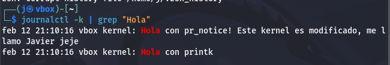

# Ejercicio: Mensaje Personalizado al Iniciar el Kernel

## Objetivo

Modificar el kernel para que muestre un mensaje personalizado durante el arranque del sistema.

---

## Paso 1: Localizar el Archivo de Inicio

El archivo principal de inicio del kernel se encuentra en:

```
init/main.c
```

Ábrelo con tu editor favorito:

```bash
nano init/main.c
```

---

## Paso 2: Buscar la Función `start_kernel()`

Busca la función:

```
start_kernel
```

En **nano**, puedes presionar:

```
Ctrl + W
```

y escribir `start_kernel` para encontrarla rápidamente.

Esta es la primera función de alto nivel que se ejecuta cuando el kernel arranca.

---

## Paso 3: Agregar el Mensaje Personalizado

Dentro de la función `start_kernel()`, busca una línea que contenga `pr_notice` o `printk`.

Agrega tu mensaje justo después de la primera llamada existente.

Ejemplo:

```c
asmlinkage __visible void __init __no_sanitize_address start_kernel(void)
{
    char *command_line;
    char *after_dashes;

    set_task_stack_end_magic(&init_task);
    smp_setup_processor_id();
    debug_objects_early_init();
    init_vmlinux_build_id();

    cgroup_init_early();

    local_irq_disable();
    early_boot_irqs_disabled = true;

    /* ============ AGREGA ESTA LÍNEA ============ */
    pr_notice("¡Hola! Este es mi kernel modificado - [Tu Nombre]\n");
    /* ========================================== */

    ...
}
```

### Nota

También puedes usar:

```c
pr_info("Mensaje\n");
```

o

```c
printk(KERN_INFO "Mensaje\n");
```

Todos cumplen la misma función: imprimir mensajes en el log del kernel durante el arranque.

---

## Paso 4: Compilar el Kernel e instalar

## Paso 5: Cómo Ver la Salida de tu Mensaje

Tu mensaje no aparece como un programa normal, sino en los logs del kernel.

Después de iniciar con tu nuevo kernel:
```c
dmesg | less
```

o usando journalctl

```c
journalctl -k | grep "Hola"
```


Esto muestra los mensajes generados por el kernel durante el arranque.